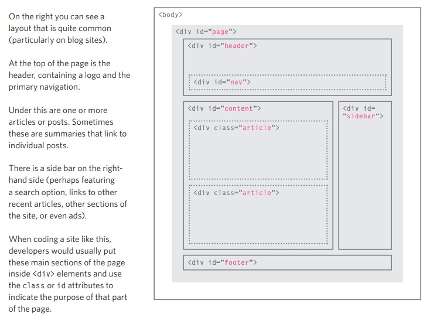
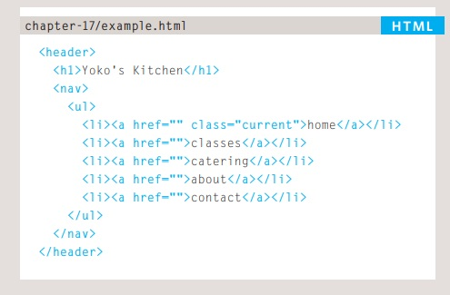
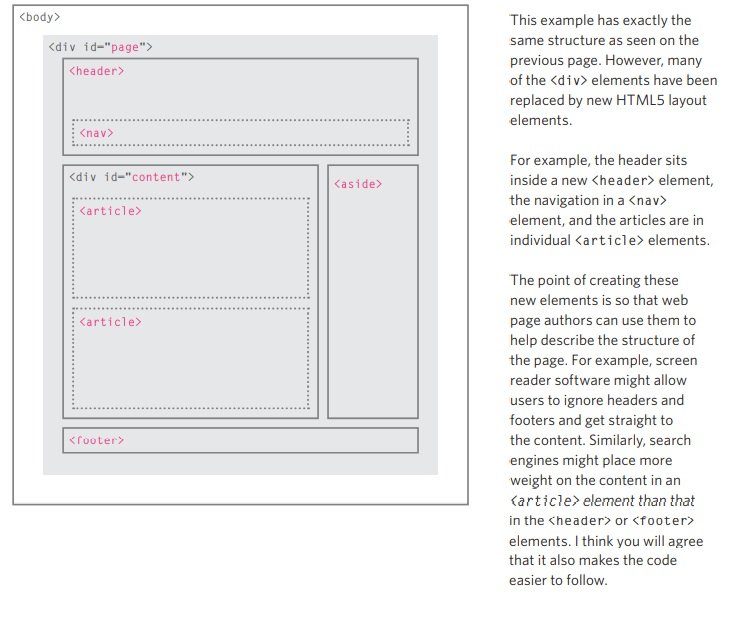
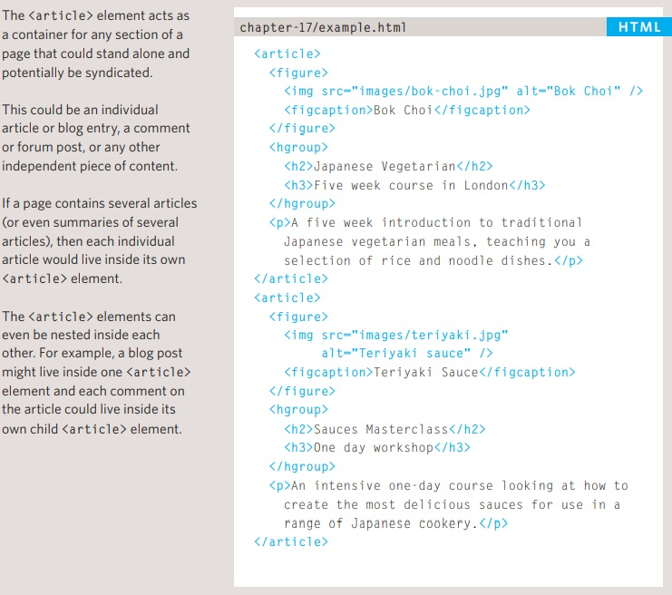
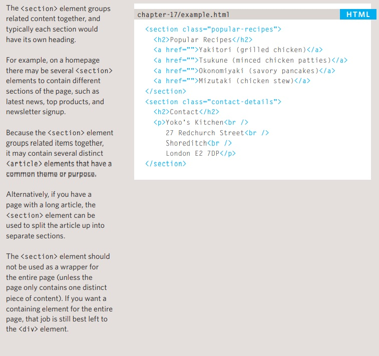
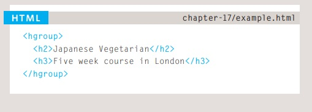
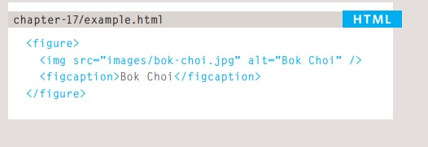

# Skim Reading 
## HTML Tags
* body tag
* head tag
* title tag

## Create web page on pc

* To create your first web page on a PC, start up Notepad. You can find this by going to:

Start
 All Programs (or Programs)
 Accessories
 Notepad

You might also like to download 
a free editor called Notepad++ 
from notepad-plus-plus.org.

* Type the code shown on the 
right.

* Go to the File menu and select Save as... You will need to save the file somewhere you can remember. If you like, you could create a folder for any examples that you try out from this book.

* Start your web browser. Go to the File menu and select Open. Browse to the file that you just created, select it and click on the Open button. The result should look something like the screen shot to the left.

## Creating a Web Page on a 

* To create your first web page on a Mac, start up TextEdit. This should be in your Applications
folder.

* Type the code shown on the right.

* Now go to the File menu and select Save as... You will need to save the file somewhere you can remember.

* Next, start your web browser, go to the File menu, and select Open. You should browse to the file that you just created, select it and click on the Open button. The result should look like the screen shot to the left.

* X HTML pages are text documents.

## Summary
* X HTML uses tags (characters that sit inside angled brackets) to give the information they surround special meaning.
* X Tags are often referred to as elements.
* X Tags usually come in pairs. The opening tag denotes the start of a piece of content; the closing tag denotes the end.
* X Opening tags can carry attributes, which tell us more about the content of that element.
* X Attributes require a name and a value.
* X To learn HTML you need to know what tags are available for you to use, what they do, and where they can go.

# Focused Reading

## Summary of chapter 8 

* The different versions of HTML and how to indicate which version you are using
* How to add comments to your code
* Global attributes, which are attributes that can be used on any element, including the class and id attributes
* Elements that are used to group together parts of the page where no other element is suitable
* How to embed a page within a page using iframes
* How to add information about the web page using the <meta> element
* Adding characters such as angled brackets and copyright symbols

## Different versions of html
### HTML4
* With the exception of a few elements added in HTML5 (which have been highlighted), the elements you have seen in this book were all available in HTML 4, although HTML 4 had some presentational elements to control the appearance of pages, authors are not recommended to use them any more. (Examples include the 
 element for centering content on a page,  for controlling the appearance of text, and <strike> to put a line through the text — all of these can be achieved with CSS instead.) .

### XHTML
* In 1998, a language called XML was published. Its purpose was to allow people to write new markup languages. Since HTML was the most widely used markup language around, it was decided that HTML 4 should be reformulated to follow the rules of XML and it was renamed XHTML. This meant that authors had to follow some new, more strict rules about writing markup. For example:
* Every element needed a closing tag (except for empty elements such as ).
* Attribute names had to be in lowercase.
* All attributes required a value, and all values were to be placed in double quotes.

### HTML5
* n HTML5, web page authors do not need to close all tags, and new elements and attributes will be introduced. At the time of writing, the HTML5 specification had not been completed, but the major browser makers had 
started to implement many of the new features, and web page authors were rapidly adopting the new markup.
Despite the fact that HTML5 is not yet completed, you can safely take advantage of the new features of the language as long as you endeavour to ensure that users with older browsers will be able to view your pages 
(even though some of the extra features will not be visible to them).

## Summary
### Comments in html
* <!-- -->

### Inline elements
* Examples of inline elements are 
<a>, <b>, <em>, and .

### Grouping Text & Elements In a Block
* div tag

### Grouping Text & Elements Inline
* span tag

### IFrames
* iframe tag

### Information About Your Pages
* meta tag

### Escape Characters
Less-than sign
&lt; 
&#60; 
Greater-than sign
&gt;
&amp;
Ampersand
&amp;
&#38;
Quotation mark
&quot; 
&#34;
Cent sign
&cent;
&#162;
Pound sign
&pound; 
&#163;
Yen sign
&yen; 
&#165;
Euro sign
&euro;
&#8364;
Copyright symbol
&copy;
&#169;
Registered trademark
&reg;
&#174;
Trademark
&trade;
&#8482;
Left single quote
&lsquo;
&#8216;
Right single quote
&rsquo;
&#8217;
Left double quotes
&ldquo; 
&#8220;
Right double quotes
&rdquo;
&#8221; 
Multiplication sign
&times;
&#215;
Division sign
&divide; 
&#247;

### Summary Extra Markup
* DOCTYPES tell browsers which version of HTML you are using.
* X You can add comments to your code between the <!-- and --> markers.
* X The id and class attributes allow you to identify particular elements.
* X The 
 and  elements allow you to group block-level and inline elements together.
* X <iframes> cut windows into your web pages through which other pages can be displayed.
* X The <meta> tag allows you to supply all kinds of information about your web page.
* X Escape characters are used to include special characters in your pages such as <, >, and ©.

## Summary of chapter 17
### Traditional HTML Layouts
* For a long time, web page authors used 
 elements to group together related elements on the page (such as the elements that form a header, an article, footer or sidebar). Authors used class or id attributes to indicate the role of the 
 element in the structure of the page.

### New Html5 Layout Elements
* HTML5 introduces a new set of elements that allow you to divide up the parts of a page. The names of these elements indicate the kind of content you will find in them. They are still subject to change, but that has not 
stopped many web page authors using them already.

### Headers & Footers
* header, footer tags

### Navigation
* nav tag

### Articles
* article tag

### ASIDES
* aside tag

### Sections
* section tag

### Heading Groups
* hgroup tag

### Figures
* figure, figcaption tags

### Linking Around 
* Block-Level Elements

### HTML5 Layout Summary
* The new HTML5 elements indicate the purpose of different parts of a web page and help to describe its structure.
* X The new elements provide clearer code (compared with using multiple 
 elements).
* X Older browsers that do not understand HTML5 elements need to be told which elements are block-level elements.
* X To make HTML5 elements work in Internet Explorer 8 (and older versions of IE), extra JavaScript is needed, 
which is available free from Google.

