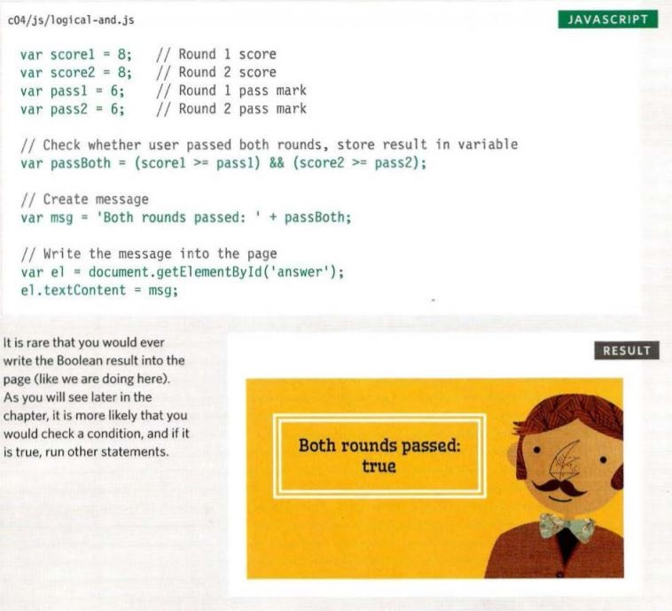
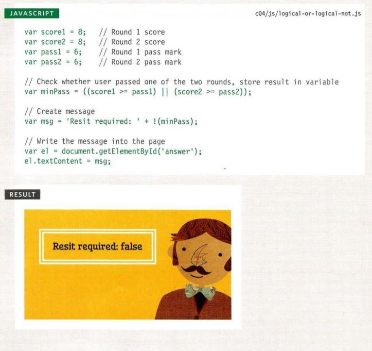

# Comparisons Operators
### Evaluating Conditions
1. The is equal to (==): This operator compares two values to see if they are the same.
2. The is not equal to (!=): This operator compares two values to see if they are not the same.
3. The strict equal to (===): This operator compares two values to check that both the data type and value are the same.
4. The strict not equal to (!==): This operator compares two values to check that both the data type and value are not the same.
5. The greater than (>): This operator checks if the number on the left side is greater than the number on the right side.
6. The less than (<): This operator checks if the number on the left side is less than the number on the right side.
7. The greater than or equal (=>): This operator checks if the number on the left side is greater than or equal to the number on the right side.
8. The less than or equal (=<): This operator checks if the number on the left side is less than or equal to the number on the right side.

### Logical Operators
1. The AND (&&) operator: This operator tests more than one condition. 
2. The OR (||) operator: This operator tests at least one condition.
3. The NOT (!) operator: This operator takes a single boolean value and inverts it.

#### Using Logical AND (&&)

#### Using Logical OR (||) And Logical NOT (!)

### Switch Statements
A switch statement starts with a variable called the switch value. Each case indicates a possible value for this variable and the code that should run if the variable matches that value.
Example:
switch (level) {
case 'One ':
title= 'Level 1 ' ;
break;
case 'Two':
tit 1 e = ' Level 2 ' ;
break;
case ' Three' :
title = 'Level 3' ;
break ;
default :
title= 'Test';
break;
}

# LOOPS
Loops check a condition. If it returns true, a code block will run.Then the condition will be checked again and if it still returns true, the code block will run again. It repeats until the condition returns false.

## Types Of Loops:
### For Loop
* If you need to run code a specific number of times use for loop.
for ( var i = 0; i<=10; i++>){ 
    statements....
}
### While Loop
* If you don't know how many times the code should run you can use while loop.
var i = 0;
while (i < 10 ){
    statements...
}
### Do-While Loop
* When you want to run the statement at least one time then you should use Do While loop.
do {
    statements..
}while( i < 10 );

## Loop Counters
1. Initialization: Create a variable and set it.
var i = 0;
2. Condition: The loop should continue to run until the counter reaches a specified number.
i < 10; 
3. Update: Every time the loop has run the statements in the curly braces it add one to the counter.
i++

