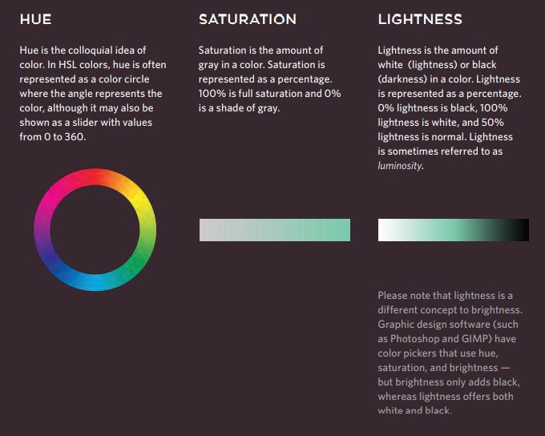

# SKIM FOR CHAPTER 10
## INTRODUNIG CSS
### What css does

* CSS allows you to create rules that control the  way that each individual box (and the contents of that box) is presented.
* CSS Associates Style rules with HTML elements.
  * CSS works by associating rules with HTML elements. These rules govern 
how the content of specified elements should be displayed. A CSS rule contains two parts: a selector and a declaration.

* CSS Properties Affect How Elements Are Displayed
  * CSS declarations sit inside curly brackets and each is made up of two 
parts: a property and a value, separated by a colon. You can specify 
several properties in one declaration, each separated by a semi-colon.

### How css works
#### Using External Sheet

### Using Internal

### CSS Selectors

### Why We Use External
* When building a website there are several advantages to placing your CSS rules in a separate style sheet.

### Summary Introducing CSS

* CSS treats each HTML element as if it appears inside its own box and uses rules to indicate how that element should look.
* Rules are made up of selectors (that specify the elements the rule applies to) and declarations (that indicate what these elements should look like).
* Different types of selectors allow you to target your rules at different elements.
* Declarations are made up of two parts: the properties of the element that you want to change, and the values of those properties. For example, the font-family property sets the choice of font, and the value arial specifies Arial as the preferred typeface.
* CSS rules usually appear in a separate document, although they may appear within an HTML page.

# READ FOR CHAPTER 11
## HOW TO SPECIFY COLOR
### Foreground Color

### Background Color

### UNDERSTANDING COLOR

### CONTRAST
* When picking foreground and background colors, it is important to ensure that there is enough contrast for the text to be legible.

### CSS3 OPACITY

### CSS3: HSL Colors
* CSS3 introduces an entirely new and intuitive way to specify colors using hue, saturation, and lightness values.

### Summary Color

* Color not only brings your site to life, but also helps convey the mood and evokes reactions.
* There are three ways to specify colors in CSS: RGB values, hex codes, and color names.
* Color pickers can help you find the color you want.
* It is important to ensure that there is enough contrast between any text and the background color (otherwise people will not be able to read your content).
* CSS3 has introduced an extra value for RGB colors to indicate opacity. It is known as RGBA.
* CSS3 also allows you to specify colors as HSL values, with an optional opacity value. It is known as HSLA.

